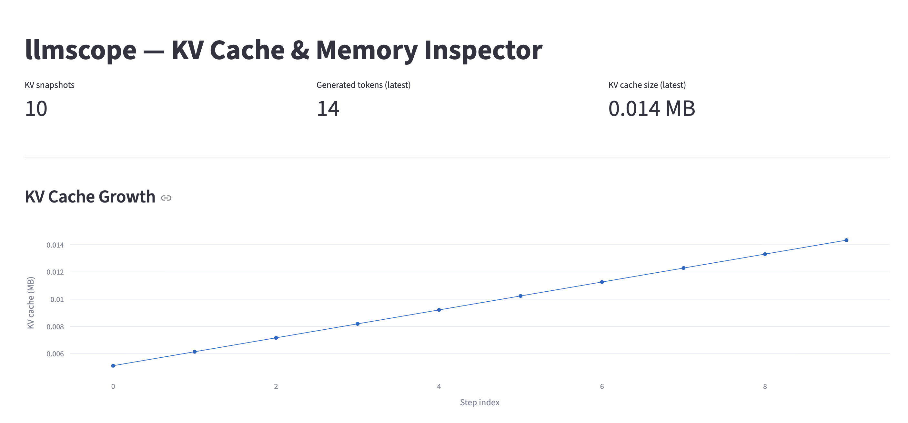
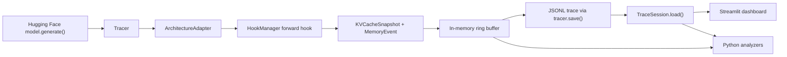
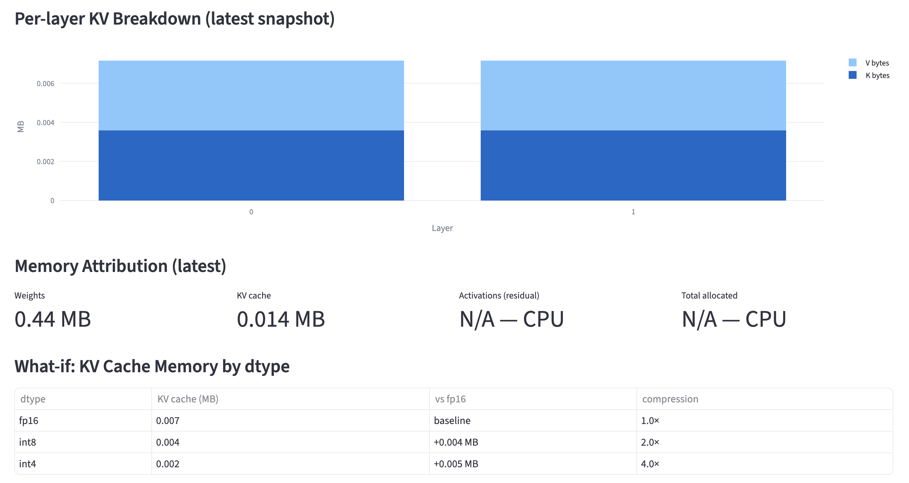

# LLMscope

[](https://github.com/andyxu-dev/llmscope/actions)
[](LICENSE)
[](pyproject.toml)

**LLMscope is a Python tracing and visualization tool for inspecting KV-cache growth and coarse memory attribution during Hugging Face causal language model inference.**

It is built for a narrow debugging/profiling workflow: run `model.generate()` under a tracer, capture per-step KV-cache snapshots, save those snapshots as JSONL, and inspect current or historical growth patterns in a Streamlit dashboard or Python analysis helpers.



Dashboard overview from the bundled tiny GPT-2 CPU demo. The demo is intentionally small and reproducible, so the absolute KV-cache sizes are tiny; CUDA allocator metrics are unavailable in this CPU run.

## What It Does

- Attaches a PyTorch forward hook to an architecture-specific model backbone.
- Extracts `past_key_values` after generation steps when `use_cache=True`.
- Records per-layer key/value tensor shapes, dtypes, byte counts, and simple float statistics.
- Records CUDA allocator memory when CUDA is available; on CPU, memory allocation metrics are reported as unavailable.
- Saves captured KV snapshots and memory events to newline-delimited JSON.
- Loads saved JSONL traces as typed, read-only trace sessions for offline analysis.
- Provides analyzers for KV growth, per-layer byte breakdown, outlier-risk heuristics, and analytical KV memory/precision what-if estimates.
- Estimates CUDA token headroom from observed KV growth and caller-provided GPU capacity.
- Provides a Streamlit dashboard that reads a JSONL trace directly, including
  OOM headroom estimates when CUDA allocator telemetry is available.

## Why It Matters

Autoregressive LLM inference stores prior keys and values so each new token can attend to previous context without recomputing the entire prefix. That KV cache grows with sequence length, batch size, layer count, key/value heads, head dimension, and dtype. LLMscope makes that growth visible in a small, inspectable project.

## Architecture



This is not a traditional frontend/backend web app. The main system is a Python instrumentation and analysis library. Streamlit is the presentation layer and imports the analysis code directly. A small FastAPI app exists, but only `/api/health` is implemented; the trace endpoint is a placeholder.

## Key Features

| Feature | Status | Notes |
|---|---:|---|
| `Tracer` context manager and explicit start/stop | Implemented | Hooks attach/detach automatically and are idempotent. |
| GPT-2-family tracing | Implemented and tested | Uses `GPT2Adapter` and tiny random GPT-2 integration tests. |
| Llama-style tracing | Implemented and optionally tested | `CausalLMAdapter` is validated against the tiny `SimpleStories/SimpleStories-1.25M` checkpoint. |
| Qwen2/Qwen2.5-style tracing | Implemented and optionally tested | `CausalLMAdapter` is validated against the tiny `trl-internal-testing/tiny-Qwen2ForCausalLM-2.5` checkpoint. |
| Mistral-style adapter | Partial | Adapter path is unit-tested with fake modules, not a real checkpoint. |
| JSONL export | Implemented and tested | `tracer.save(path)` writes snapshots and memory events. |
| JSONL load | Implemented and tested | `TraceSession.load(path)` reconstructs typed snapshots and memory events without a model. |
| Streamlit dashboard | Implemented | Reads JSONL from `LLMSCOPE_TRACE_PATH`; includes OOM diagnostics for CUDA traces; helper logic is tested. |
| What-if KV estimator | Implemented and tested | Analytical estimate only; it does not quantize a model. |
| OOM headroom estimator | Implemented and tested | Conservative estimate from observed KV growth, CUDA allocator usage, and explicit device capacity. |
| OOM precision scenarios | Implemented and tested | Analytical estimate of how KV storage precision could affect current headroom and future KV growth. |
| FastAPI backend | Placeholder | Health check works; trace creation returns 501. |
| CLI | Minimal | Installed `llmscope version` works; `serve` and `instrument` exit without behavior. |
| Attention-weight capture | Not implemented | The config flag exists, but no capture path is implemented. |

## Example Workflow

```python
import torch
from transformers import GPT2Config, GPT2LMHeadModel
from llmscope import Tracer

cfg = GPT2Config(n_layer=2, n_head=2, n_embd=64, vocab_size=100, n_positions=64)
model = GPT2LMHeadModel(cfg).eval()
input_ids = torch.randint(0, 100, (1, 5))

with Tracer(model) as tracer:
    with torch.no_grad():
        model.generate(input_ids, max_new_tokens=10, use_cache=True)

print(tracer.summary())
tracer.save("examples/demo_trace.jsonl")
```

Historical traces can be loaded without rerunning model inference:

```python
from llmscope import TraceSession
from llmscope.analysis import KVCacheAnalyzer

trace = TraceSession.load("examples/demo_trace.jsonl")
result = KVCacheAnalyzer().analyze(trace.kv_snapshots)
```

CUDA traces can also be used for conservative token-headroom estimates:

```python
from llmscope.analysis import OOMAnalyzer

headroom = OOMAnalyzer().estimate(
    snapshots=trace.kv_snapshots,
    memory_events=trace.memory_events,
    device_capacity_bytes=24 * 1024**3,
    safety_margin_bytes=1 * 1024**3,
)
```

Analytical KV precision scenarios can estimate how changing KV storage size would
affect the same headroom calculation:

```python
from llmscope.analysis import OOMAnalyzer

scenarios = OOMAnalyzer().compare_kv_precision(
    snapshots=trace.kv_snapshots,
    memory_events=trace.memory_events,
    device_capacity_bytes=24 * 1024**3,
    target_dtypes=("fp16", "int8", "int4"),
)
```

These scenarios do not enable KV quantization or guarantee that a model/runtime
supports the requested precision. They replace the observed KV footprint with an
analytical target size and scale future KV growth by the same byte-width ratio.
Actual runtime memory may differ because of quantization metadata, packing,
padding, alignment, allocator behavior, temporary buffers, and kernel details.
INT4 is modeled as a theoretical packed 0.5-byte-per-element estimate.

The OOM analyzer observes KV-cache growth and estimates how much additional KV
growth can fit if non-KV allocated memory remains approximately constant. It is
not a guaranteed CUDA OOM prediction: temporary allocations, changing activation
memory, allocator fragmentation, other GPU processes, PyTorch reserved-memory
behavior, and model-specific generation differences can make real behavior
differ. Set `safety_margin_bytes` to reserve extra capacity for a more
conservative estimate.

## Dashboard

The dashboard consumes an existing JSONL trace:

```bash
export LLMSCOPE_TRACE_PATH=examples/demo_trace.jsonl
python -m streamlit run src/llmscope/dashboard/app.py
```

It shows KV-cache growth over steps, latest per-layer K/V byte breakdown, latest memory attribution, OOM KV-growth headroom estimates for traces with CUDA allocator telemetry, analytical KV precision headroom scenarios, and an analytical dtype what-if table.

The bundled CPU demo does not contain CUDA allocator telemetry, so OOM estimates are unavailable for that demo. CPU traces remain valid for KV growth, per-layer analysis, memory attribution summaries, and analytical dtype what-if estimates.



Layer and memory analysis from the same tiny GPT-2 CPU demo. The dtype what-if table is an analytical byte estimate for alternative KV-cache dtypes, not actual quantized inference.

## Installation

This repository is not published to PyPI under the `andyxu-dev/llmscope` project. Install from source:

```bash
git clone https://github.com/andyxu-dev/llmscope.git
cd llmscope
python -m pip install -e ".[dashboard,dev]"
```

Do not assume `pip install llmscope` installs this repository; the PyPI name is currently occupied by an unrelated project.

Requires Python >= 3.9, PyTorch >= 2.0, transformers >= 4.35, pydantic >= 2.0, and numpy. The dashboard extra adds Streamlit and Plotly.

## Quick Start

No model download is required for the bundled demo:

```bash
python examples/demo.py
```

The demo builds a tiny random-weight GPT-2 model, traces a short CPU generation, prints a summary, and writes `examples/demo_trace.jsonl`.

## Example Output

```text
llmscope Tracer  session=<uuid>
Weights : 0.44 MB
KV snapshots : 10 captured
KV tokens    : 5 -> 14  (0.014 MB latest)
Memory : N/A (CPU mode - no CUDA allocator)
```

## Testing

Verified locally on Python 3.12.6:

```bash
python -m ruff check src tests examples
python -m mypy src
python -m pytest -q
```

Current result: 148 tests pass, with 2 optional integration tests skipped, and 83% total coverage.

## Current Limitations

- CPU runs are supported for KV-cache tracing, but CUDA allocator memory metrics are unavailable on CPU.
- LLMscope does not intercept CUDA allocations directly; activation memory is estimated as a residual from allocator totals.
- Per-layer attribution applies to KV bytes from tensor sizes, not full GPU memory ownership.
- What-if precision analysis is analytical only; it does not run quantized inference.
- OOM diagnostics estimate KV-growth headroom only; they are not guaranteed OOM predictions or automatic optimization recommendations.
- Llama checkpoint tracing is validated with one tiny public checkpoint only.
- Qwen2/Qwen2.5 checkpoint tracing is validated with one tiny public checkpoint only.
- Real Mistral checkpoint tracing is not covered by tests in this repo.
- Streamlit is the main UI; there is no production backend or real-time streaming API.
- `Tracer.load()` is intentionally not part of the live tracer API; use `TraceSession.load()` for saved JSONL traces.
- `Tracer.serve()`, attention-weight capture, and the `/api/trace` endpoint are not implemented.

## Roadmap

- Add real-checkpoint adapter validation for Mistral and related grouped-query attention models.
- Add a safer CLI for running demos and launching the dashboard.
- Decide whether to rename the package or publish under a non-conflicting PyPI name.
- Expand dashboard test coverage with a browser-level smoke test.
